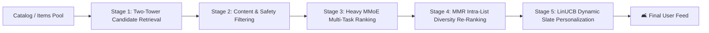

# 🛋️ আসেন Unproductive হই (Asen Unproductive Hoi)
### *The Ultimate AI Procrastination & Distraction Engine*
> **A Unified Full-Stack Recommendation System synthesizing 20 years of breakthrough production architectures from Netflix, YouTube, TikTok, Alibaba, and Meta.**


---

## 📖 সারসংক্ষেপ (About the Platform)

**"আসেন Unproductive হই"** একটি হাই-পারফরম্যান্স মাল্টি-মডেল রিকমেন্ডেশন প্ল্যাটফর্ম। আধুনিক সোশ্যাল মিডিয়া এবং স্ট্রিমিং অ্যাপে ঢুকে আমরা যেভাবে ঘণ্টার পর ঘণ্টা অলস সময় কাটিয়ে দিই, তার পেছনে কাজ করে বিশ্বের সবচেয়ে জটিল মেশিন লার্নিং অ্যালগরিদমগুলো। 

এই প্রজেক্টে নেটফ্লিক্স, ইউটিউব, টিকটক, আলিবাবা এবং মেটার বাস্তব প্রোডাকশনে ব্যবহৃত **১০টিরও বেশি কোর অ্যালগরিদম**, **৫-স্টেজের ফুল-স্কেল প্রোডাকশন পাইপলাইন**, **কন্টেক্সচুয়াল ব্যান্ডিট দিয়ে ডায়নামিক আর্টওয়ার্ক পারসোনালাইজেশন** এবং **অফিশিয়াল TMDB থিয়েট্রিক্যাল পোস্টার** এক ছাদের নিচে নিয়ে আসা হয়েছে।

---

## 📸 প্ল্যাটফর্ম গ্যালারি (Screenshots Showcase)

| 🛋️ Procrastination Hub & Real TMDB Posters | 🧪 Algorithm Lab (Pick Your Distraction Engine) |
|:---:|:---:|
|  |  |

| 🎨 LinUCB Artwork Personalization Bandit | ⚔️ Model Arena Tournament Leaderboard |
|:---:|:---:|
|  |  |

---

## 🧠 ৬ প্রজন্মের ১০টি কোর অ্যালগরিদম (Model Zoo)

| জেনারেশন | অ্যালগরিদম | উদ্ভাবক / কোম্পানি | মূল বৈশিষ্ট্য |
|---|---|---|---|
| **Gen 1 (Heuristics)** | **Time-Decayed Popularity** | Baseline | এক্সপোনেনশিয়াল টাইম-ডিকে সহ ট্রেন্ডিং স্কোর |
| **Gen 1 (Heuristics)** | **Item-Item Collaborative Filtering** | Amazon (2001) | ইউজার অ্যাকশন ভেক্টরের উপর কোসাইন সিমিলারিটি |
| **Gen 2 (Latent Factor)** | **Implicit ALS** | Yahoo / AT&T (2008) | অল্টারনেটিং লিস্ট স্কয়ার্স ম্যাট্রিক্স ফ্যাক্টোরাইজেশন |
| **Gen 2 (Latent Factor)** | **BPR-MF** | Rendle et al. (2009) | বেয়েশিয়ান পেয়ারওয়াইজ অপ্টিমাইজেশন |
| **Gen 3 (Deep Retrieval)**| **Two-Tower DNN** | YouTube (2016) | ইউজার ও আইটেম নিউরাল টাওয়ার + ভেক্টর অ্যানিমেশন (ANN) |
| **Gen 4 (Deep Ranking)** | **Wide & Deep** | Google Play (2016) | মেমোরাইজেশন (Wide) + জেনারেলাইজেশন (Deep) |
| **Gen 4 (Deep Ranking)** | **DeepFM** | Huawei (2017) | কোনো ম্যানুয়াল ফিচার ইঞ্জিনিয়ারিং ছাড়া FM + Deep Nets |
| **Gen 4 (Deep Ranking)** | **DIN (Deep Interest Network)** | Alibaba (2018) | ক্যান্ডিডেট আইটেমের সাপেক্ষে লোকাল অ্যাটেনশন মেকানিজম |
| **Gen 4 (Multi-Task)** | **MMoE (Mixture of Experts)** | Google (2018) | ক্লিক (CTR), ওয়াচ-টাইম এবং রেটিং একসাথে প্রেডিক্ট |
| **Gen 5 (Transformers)** | **SASRec** | UCSD (2018) | সেলফ-অ্যাটেনশন দিয়ে ইউজারের সিকোয়েন্সিয়াল বিহেভিয়ার মডেলিং |
| **Gen 5 (Graph Neural)** | **LightGCN** | NUS (2020) | গ্রাফ বাইপারটাইট নেইবারহুড অ্যাগ্রিগেশন |
| **Gen 6 (Bandits & RL)** | **LinUCB Contextual Bandit** | Netflix (2018) | একই মুভির ভিন্ন পোস্টার ইউজারের টেস্ট অনুযায়ী ডায়নামিক সিলেক্ট |

---

## ⚡ ৫-স্টেজের প্রোডাকশন পাইপলাইন (5-Stage Pipeline)

বাস্তব প্রোডাকশনে কোটি কোটি আইটেম থেকে নিমেষেই ইউজারের স্ক্রিনে রিকমেন্ডেশন দেখানোর জন্য প্ল্যাটফর্মটি ইন্ডাস্ট্রি-স্ট্যান্ডার্ড ৫টি ধাপে কাজ করে:



1. **Stage 1 (Candidate Retrieval):** হাজার হাজার মুভি থেকে মিলিসেকেন্ডের মধ্যে সেরা ক্যান্ডিডেট নির্বাচন।
2. **Stage 2 (Filtering):** দেখা মুভি বা ফিল্টারিং ক্রাইটেরিয়া দিয়ে বাদ দেওয়া।
3. **Stage 3 (Heavy Ranking):** ডিপ নিউরাল নেট (MMoE) দিয়ে প্রতিটি আইটেম স্কোর করা।
4. **Stage 4 (MMR Diversity):** সব আইটেম যেন এক ধরণের না হয়, ডাইভার্সিটি নিশ্চিত করা।
5. **Stage 5 (Slate & Artwork Bandit):** নেটফ্লিক্স স্টাইলে ৫টি ক্যাটাগরি রো এবং পারসোনালাইজড পোস্টার আর্টওয়ার্ক তৈরি।

---

## 🚀 কীভাবে চালাবেন (Quick Start Guide)

এই প্রজেক্টটি চালানোর জন্য আপনার পছন্দমতো ৩টি উপায় রয়েছে:

### অপশন ১: ফুল-স্ট্যাক মোড (FastAPI + React 19)
```bash
# ১. রিপোজিটরি ক্লোন করুন
git clone https://github.com/rakibdipu/asen-unproductive-hoi.git
cd asen-unproductive-hoi

# ২. পাইথন ডিপেন্ডেন্সি ইনস্টল করুন
pip install -r backend/requirements.txt

# ৩. ব্যাকএন্ড সার্ভার চালু করুন (Port 8000)
python -m uvicorn backend.main:app --host 0.0.0.0 --port 8000 --reload

# ৪. নতুন টার্মিনালে ফ্রন্টএন্ড চালু করুন (Port 5173)
cd frontend
npm install
npm run dev
```
👉 ব্রাউজারে ওপেন করুন: **http://localhost:5173**

---

### অপশন ২: অল-ইন-ওয়ান সিঙ্গেল ফাইল মোড (`single_file_app.py`)
কোনো নোড বা ফ্রন্টএন্ড ফোল্ডারের ঝামেলা ছাড়া এক কমান্ডে সম্পূর্ণ অ্যাপ চালানো:
```bash
python single_file_app.py
```
👉 ব্রাউজারে ওপেন করুন: **http://localhost:8000** (সবকিছু এই এক ফাইলের ভেতর থেকেই লাইভ চালু হবে!)

---

### অপশন ৩: জিরো-ডিপেন্ডেন্সি ডাবল-ক্লিক মোড (`standalone_asen_unproductive_hoi.html`)
কোনো পাইথন বা সার্ভার ছাড়াই সরাসরি ডাবল ক্লিকে সম্পূর্ণ অ্যাপ চালানো:
- ফাইল ম্যানেজার থেকে `standalone_asen_unproductive_hoi.html` ফাইলে **ডাবল ক্লিক** করুন!
- যে কোনো ব্রাউজারে অফিশিয়াল পোস্টার, অ্যালগরিদম ল্যাব ও আর্টওয়ার্ক ব্যান্ডিট সহ পুরো অ্যাপ চালু হয়ে যাবে।

---

## 🔌 API এন্ডপয়েন্টস রেফারেন্স (REST API)

- `GET /` — প্ল্যাটফর্ম ল্যান্ডিং পেজ
- `GET /api/health` — ব্যাকএন্ড হেলথ ও রেজিস্টার্ড মডেল স্ট্যাটাস
- `GET /api/items` — TMDB অফিশিয়াল পোস্টারসহ মুভি ক্যাটালগ
- `POST /api/recommend/single` — একক অ্যালগরিদম দিয়ে রিকমেন্ডেশন জেনারেশন
- `POST /api/recommend/pipeline` — ৫-স্টেজের পূর্ণাঙ্গ প্রোডাকশন পাইপলাইন রান করা
- `POST /api/benchmark/arena` — মডেল এরিনা টুর্নামেন্ট ও লিডারবোর্ড জেনারেশন
- `GET /api/artwork/status` — LinUCB আর্টওয়ার্ক ব্যান্ডিট পুল ও উইন-রেট স্ট্যাটাস
- `POST /api/artwork/simulate-round` — ইউজারের পোস্টার ক্লিকে ব্যান্ডিট রিওয়ার্ড আপডেট
- `WS /api/events/ws` — রিয়েল-টাইম ওয়েবসকেট ইউজার ইন্টারঅ্যাকশন ইভেন্ট স্ট্রিম

Interactive Swagger API Docs দেখতে ব্রাউজারে যান: **http://localhost:8000/docs**

---

## 📂 ফাইল ও ডিরেক্টরি স্ট্রাকচার (Repository Structure)

```
asen-unproductive-hoi/
├── backend/
│   ├── api/             # FastAPI রাউটারস (recommend, events, arena, artwork)
│   ├── bandits/         # LinUCB এবং Thompson Sampling আর্টওয়ার্ক ব্যান্ডিট
│   ├── data/            # ডেটাসেট ম্যানেজার ও অফিশিয়াল TMDB পোস্টার মেটাডাটা
│   ├── evaluation/      # NDCG, Hit Rate, Diversity মেট্রিকস এবং এরিনা
│   ├── models/          # ১০টি কোর অ্যালগরিদমের নিজস্ব পাইথন ইমপ্লিমেন্টেশন
│   ├── pipeline/        # ৫-স্টেজের প্রোডাকশন রিকমেন্ডেশন পাইপলাইন
│   └── streaming/       # রিয়েল-টাইম ওয়েবসকেট ইভেন্ট বাস ও ফিচার স্টোর
├── frontend/
│   ├── src/
│   │   ├── components/  # Navbar, FunnelChart, ItemGrid, LiveEventTicker
│   │   └── pages/       # Home, RecLab, PipelineView, ArenaView, ArtworkView
│   ├── package.json
│   └── vite.config.ts
├── docs/screenshots/    # প্ল্যাটফর্মের লাইভ স্ক্রিনশটসমূহ
├── single_file_app.py   # সম্পূর্ণ ফুল-স্ট্যাক সিস্টেমের অল-ইন-ওয়ান সিঙ্গেল ফাইল
├── standalone_asen_unproductive_hoi.html # পোর্টেবল জিরো-ডিপেন্ডেন্সি ফাইল
└── README.md
```

---

## 📜 লাইসেন্স (License)

This project is licensed under the **MIT License** — feel free to use it for learning, research, or building your own distraction platforms!

<p align="center">
  <b>🛋️ আসেন Unproductive হই — কাজে ফাঁকি দিন, তবে মেশিন লার্নিং দিয়ে! 🪫</b>
</p>
