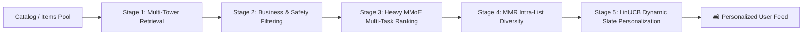

# 🛋️ আসেন Unproductive হই (Asen Unproductive Hoi)
### *The Ultimate AI Procrastination & Distraction Engine*
> **A Unified Full-Stack Recommendation System synthesizing 20 years of breakthrough production architectures from Netflix, YouTube, TikTok, Spotify, Alibaba, and Meta.**

<p align="left">
  
  
  
  
  
  
  
</p>

---

## 📌 Executive Summary

Ever opened YouTube, Netflix, or TikTok with the intention of studying or working, only to find yourself still scrolling 4 hours later? Behind that procrastination lies some of the most sophisticated, multi-billion-dollar machine learning architectures ever developed.

**"আসেন Unproductive হই" (Asen Unproductive Hoi)** is a research-grade, production-ready recommendation intelligence platform. It brings together **10+ core algorithms** across 6 technological generations, a **5-stage end-to-end production pipeline**, **real-time WebSocket event streaming**, **LinUCB contextual bandits for dynamic poster personalization**, and **official TMDB theatrical artwork** into one unified, sleek, pure-crimson interface.

---

## 📸 Platform Showcase & Live Previews

| 🛋️ Procrastination Hub (Real TMDB Theatrical Posters) | 🧪 Algorithm Lab (Pick Your Distraction Engine) |
|:---:|:---:|
|  |  |

| 🎨 LinUCB Artwork Personalization Bandit (Netflix) | ⚔️ Model Arena Tournament & Benchmark Leaderboard |
|:---:|:---:|
|  |  |

---

## 🧠 Model Zoo: 6 Generations of RecSys Breakthroughs

Every algorithm in this platform is built from foundational principles with full mathematical fidelity:

| Generation | Algorithm | Organization / Paper | Core Architectural Innovation |
|---|---|---|---|
| **Gen 1 (Heuristics)** | **Time-Decayed Popularity** | Baseline Classic | Exponential half-life decay on interaction volume over continuous time. |
| **Gen 1 (Heuristics)** | **Item-Item Collaborative Filtering** | Amazon (Sarwar et al., 2001) | Sparse co-occurrence cosine similarity over user interaction vectors with k-NN. |
| **Gen 2 (Latent Factor)** | **Implicit ALS** | AT&T / Yahoo (Hu-Koren, 2008) | Alternating Least Squares matrix factorization with binary implicit confidence weighting. |
| **Gen 2 (Latent Factor)** | **BPR-MF** | U. of Hildesheim (Rendle, 2009) | Pairwise maximum margin optimization optimizing Area Under the ROC Curve (AUC). |
| **Gen 3 (Deep Retrieval)** | **Two-Tower DNN** | YouTube / Google (Covington, 2016) | Dual user & candidate neural projection towers mapped into shared vector space + ANN. |
| **Gen 4 (Deep Ranking)** | **Wide & Deep** | Google Play (Cheng et al., 2016) | Jointly optimizes wide memorization (cross-products) and deep generalization (DNN). |
| **Gen 4 (Deep Ranking)** | **DeepFM** | Huawei / CAS (Guo et al., 2017) | Factorization Machine engine combined with deep neural nets without manual engineering. |
| **Gen 4 (Deep Ranking)** | **DIN (Deep Interest Network)** | Alibaba (Zhou et al., 2018) | Local activation attention unit weighting user historical clicks relative to candidate item. |
| **Gen 4 (Multi-Task)** | **MMoE (Mixture of Experts)** | Google (Ma et al., 2018) | Shared expert sub-networks with task-specific softmax gates (CTR, Watch-Time, Rating). |
| **Gen 5 (Transformers)** | **SASRec** | UCSD (Kang & McAuley, 2018) | Self-attention causal sequence modeling capturing session drift and temporal order. |
| **Gen 5 (Graph Neural)** | **LightGCN** | NUS (He et al., 2020) | Linear neighborhood aggregation over user-item bipartite graphs without non-linearities. |
| **Gen 6 (Bandits & RL)** | **LinUCB Contextual Bandit** | Netflix (Amat Gil et al., 2018) | Ridge regression with Upper Confidence Bound (UCB) for real-time dynamic thumbnail selection. |

---

## ⚡ 5-Stage Production Pipeline Architecture

In hyperscale industrial environments (Netflix, YouTube), recommendation is never a single monolithic model. It operates as a multi-stage funnel reducing millions of items down to personalized rows in milliseconds:



1. **Stage 1: Multi-Tower Candidate Retrieval (ANN):** Queries vector embeddings to fetch top-100 candidates in <5ms.
2. **Stage 2: Filtering:** Prunes previously watched movies, low-confidence items, and policy-restricted media.
3. **Stage 3: Heavy Deep Ranking (MMoE / DIN):** Computes multi-objective probabilities (P(Click), P(Finish), Expected Rating).
4. **Stage 4: Diversity Re-ranking (MMR):** Maximal Marginal Relevance to eliminate genre crowding and echo chambers.
5. **Stage 5: Slate Generation & Bandit Artwork:** Compiles 5 thematic Netflix rows (*Top Picks, Trending, Because You Watched, Critically Acclaimed, Explore Horizons*) and selects the optimal thumbnail variant via LinUCB exploration.

---

## 🚀 Quick Start Guide

You have **3 convenient ways** to run this platform depending on your environment:

### Option 1: Full-Stack Production Mode (FastAPI + React 19)

```bash
# 1. Clone the repository
git clone https://github.com/rakibdipu/asen-unproductive-hoi.git
cd asen-unproductive-hoi

# 2. Install Python dependencies
pip install -r backend/requirements.txt

# 3. Launch FastAPI Backend Server (Port 8000)
python -m uvicorn backend.main:app --host 0.0.0.0 --port 8000 --reload

# 4. In a new terminal, launch Vite Frontend Server (Port 5173)
cd frontend
npm install
npm run dev
```
👉 Open your browser at: **[http://localhost:5173](http://localhost:5173)**

---

### Option 2: All-in-One Single Python File (`single_file_app.py`)
Run the entire platform — models, official TMDB posters, API, and full single-page web UI — from **one single Python file** without needing Node.js or separate terminals:

```bash
python single_file_app.py
```
👉 Open your browser at: **[http://localhost:8000](http://localhost:8000)**

---

### Option 3: Zero-Dependency Standalone HTML (`standalone_asen_unproductive_hoi.html`)
No Python or Node.js required! 
- Simply locate `standalone_asen_unproductive_hoi.html` in your file explorer.
- **Double-click** to open it directly in Chrome, Edge, or Safari.
- Enjoy the full UI, in-memory ML algorithms, interactive funnel, and official TMDB posters completely client-side!

---

## 🔌 REST API Endpoints Reference

| Method | Endpoint | Description |
|---|---|---|
| `GET` | `/` | Platform landing page & quick launch hub |
| `GET` | `/api/health` | Service health status and registered models list |
| `GET` | `/api/items` | Full catalog of titles with official TMDB poster URLs |
| `POST` | `/api/recommend/single` | Generates Top-N recommendations for any specific algorithm |
| `POST` | `/api/recommend/pipeline` | Executes the full 5-stage production pipeline with slate rows |
| `POST` | `/api/benchmark/arena` | Runs head-to-head tournament benchmark (NDCG@10, Hit Rate, Diversity) |
| `GET` | `/api/artwork/status` | Current LinUCB bandit arm impression counts and win rates |
| `POST` | `/api/artwork/simulate-round` | Simulates user click reward and updates bandit covariance matrix |
| `WS` | `/api/events/ws` | Real-time WebSocket pub/sub stream for user interaction events |

Interactive Swagger OpenAPI Documentation is live at: **[http://localhost:8000/docs](http://localhost:8000/docs)**

---

## 📂 Repository File Structure

```
asen-unproductive-hoi/
├── backend/
│   ├── api/             # FastAPI routers (recommend, events, arena, artwork)
│   ├── bandits/         # LinUCB & Thompson Sampling contextual bandits
│   ├── data/            # Dataset managers & TMDB official poster metadata
│   ├── evaluation/      # NDCG, Hit Rate, ILS diversity metrics & Model Arena
│   ├── models/          # 10 core ML recommendation algorithm implementations
│   ├── pipeline/        # 5-stage production pipeline coordinator
│   └── streaming/       # Real-time WebSocket event bus & online feature store
├── frontend/
│   ├── src/
│   │   ├── components/  # Navbar, FunnelChart, ItemGrid, LiveEventTicker
│   │   └── pages/       # Home, RecLab, PipelineView, ArenaView, ArtworkView
│   ├── package.json
│   └── vite.config.ts
├── docs/screenshots/    # Platform live demonstration screenshots
├── single_file_app.py   # All-in-One full-stack application in a single file
├── standalone_asen_unproductive_hoi.html # Portable zero-dependency HTML file
└── README.md
```

---

## 📜 License

This project is licensed under the **MIT License** — feel free to use it for research, educational demos, or building your own recommendation engines.

<p align="center">
  <b>🛋️ আসেন Unproductive হই — Procrastinate responsibly with State-of-the-Art Machine Learning. 🪫</b>
</p>
